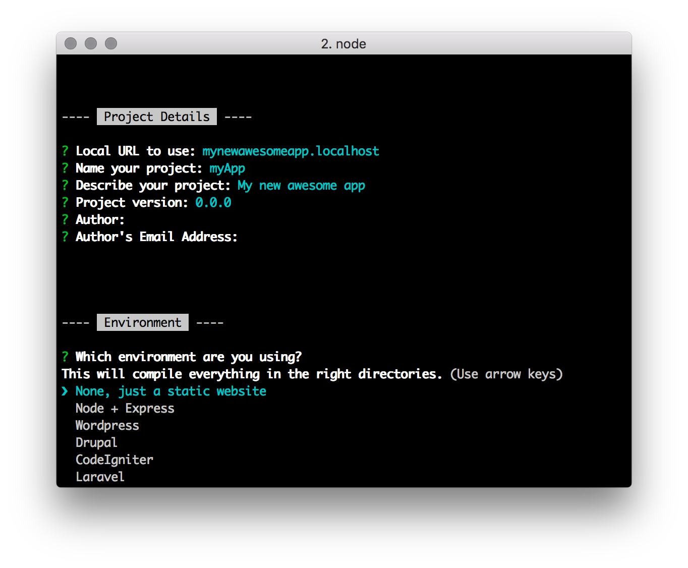
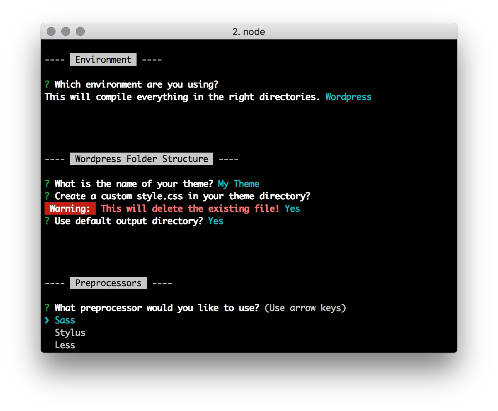
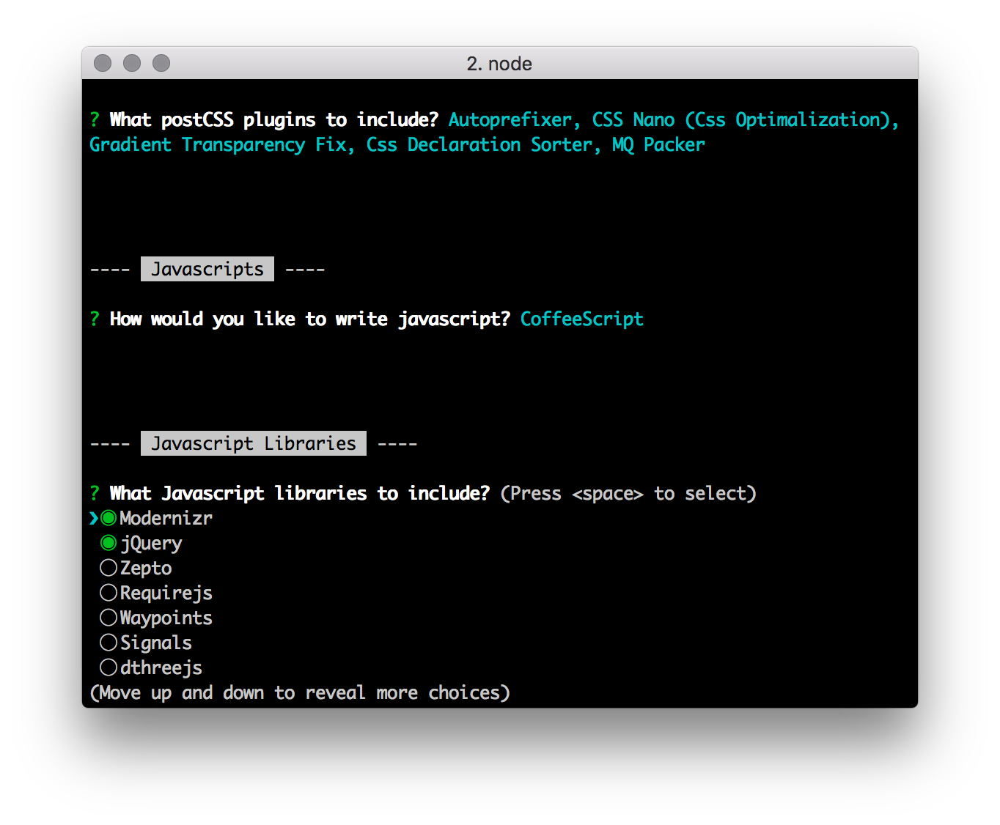

# Robonkey Generator

> A [Yeoman](http://yeoman.io) front-end application generator for Gulp, Jade/Nunjucks, Sass/Stylus/Less, Coffeescript, PostCSS, Modernizr, Custom Icon Font Generator, BrowserSync, and some JavaScript and Sass/Stylus/Less libraries to choose from. Express, Wordpress, Drupal, CodeIgniter and Laravel subgenerators are also available.

> _**This generator is a work in progress.<br>
> There probably will be some bugs and missing features.<br>
> Likewise, this documentation isn't finished yet either.**_





## Table of contents

- [Features](#features)
- [Getting Started](#getting-started)
- [Options](#options)
- [Subgenerators](#subgenerators)
- [To Do](#to-do)
- [Docs](#docs)

## Features

- [Gulp](http://gulpjs.com/)
- Html templating
	- [Jade](http://jade-lang.com/)
	- [Nunjucks](http://jade-lang.com/)
- Preprocessors:
	- [SASS](http://sass-lang.com/) with [optional libraries](/docs/features.md#sass-libraries)
	- [Stylus](http://stylus-lang.com/) with [optional libraries](/docs/features.md#stylus-libraries)
	- [Less](http://lesscss.org/) with [optional libraries](/docs/features.md#less-libraries)
- [BrowserSync](https://www.browsersync.io/)
- PostCSS:
	- [Autoprefixer](https://github.com/postcss/autoprefixer)
	- [Lost Grid](https://github.com/peterramsing/lost)
	- [Css Nano](https://github.com/ben-eb/cssnano)
	- [Gradient Transparency Fixer](https://github.com/gilmoreorless/postcss-gradient-transparency-fix)
	- [MQPacker](https://github.com/hail2u/node-css-mqpacker)
	- [MQKeyframes](https://github.com/TCotton/postcss-mq-keyframes)
	- [CSS Next](http://cssnext.io/)
	- [CSS Grace](https://github.com/cssdream/cssgrace)
	- [Rucksack](https://simplaio.github.io/rucksack/)
	- [Class Prefix](https://github.com/thompsongl/postcss-class-prefix)
	- [Scopify](https://github.com/pazams/postcss-scopify)
- [Imagemin](https://github.com/sindresorhus/gulp-imagemin)
- Custom Icon Font Generator:
	- [iconfont](https://github.com/nfroidure/gulp-iconfont)
	- [iconfont-css](https://github.com/backflip/gulp-iconfont-css)
- [Modernizr Builder](https://github.com/doctyper/gulp-modernizr)


## Getting Started

Install yo

```sh
$ npm install -g yo
```

Install Robonkey

```sh
$ npm install -g generator-robonkey
```

Then you can start building your app with Robonkey:

```sh
$ mkdir yourapp
$ cd yourapp
$ yo robonkey
```

## Subgenerators

Subgenerators for Express, WordPress, Drupal, CodeIgniter and Laravel are available and should be run before the main generator.

```sh
$ yo robonkey:express
$ yo robonkey:wordpress
$ yo robonkey:drupal
$ yo robonkey:codeigniter
$ yo robonkey:laravel
```

## To Do

- Priority:
	- Update docs

- maybe further down the road
	- subgenerator for wordpress drupal theme
	- …


## Docs

- [Home](/README.md)
- [Getting started](/docs/getting-started.md)
- [Features](/docs/features.md)
- [Options](/docs/options.md)
- [HTML templating](/docs/html.md)
- [Images](/docs/images.md)
- [Sass](/docs/sass.md)
- [Stylus](/stylus/stylus.md)
- [Less](/docs/less.md)
- [Modernizr](/docs/modernizr.md)
- [Custom Icon Font](/docs/custom-icon-font.md)
